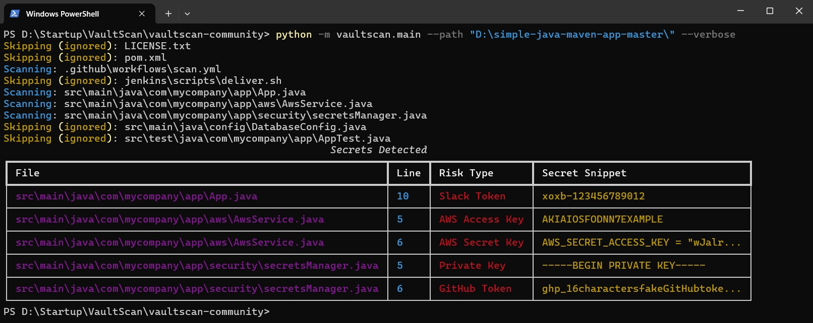

# VaultScan – Community Edition (v1.2)

<p align="center">
  
</p>


> ⭐ Star / 👀 Watch / 🍴 Fork this project if you find it useful!

---

👉 Try VaultScan now → [vaultscanhq/vaultscan-community](https://github.com/vaultscanhq/vaultscan-community)

---

## 🚀 About VaultScan

**VaultScan** is a fast, lightweight, privacy-first secrets and credential leak detection tool for code repositories.

Designed for DevOps, Cloud Security, and Development teams to **prevent accidental secret exposures** before they become million-dollar breaches.

Built for local, offline-first scanning with modular design for future cloud expansion.

---

## ✨ What's New in v1.2

- Added --help support for the CLI.
- Improved .vaultscanignore edge case handling.
- Added verbose logging for skipped files and directories.
- Refactored CLI code for better error messages and structure.
- Polished CLI alignment and Rich output formatting.
- Enhanced GitHub Actions support with workflow templates.
- Added support for new secret patterns:  
  GCP API Keys, Azure Keys, JWT Tokens, Database URIs, Basic Auth URLs, and Twilio Auth Tokens

---

## 🎯 Key Features

- 🔍 Scans local code repositories for leaked credentials.
- 🔒 100% Privacy-first: No data leaves your machine.
- 🎨 Beautiful Rich CLI output for better visibility.
- ⚡ Lightweight and fast scanning.
- 📂 Supports ignore patterns via `.vaultscanignore`.
- 🛡️ Risk scoring for better secret prioritization.
- 🧠 High-entropy secret detection (coming soon).
- 🔎 Supports both file and directory input scanning.

---
## 📸 Screenshots

### 🖥️ CLI Output


### ⚙️ GitHub Action Logs


### 🛒 GitHub Marketplace Listing

---

---

## 🔗 Integrations

- 🔧 GitHub Action: [vaultscanhq/vaultscan-action](https://github.com/vaultscanhq/vaultscan-action)  
- 🛒 Marketplace: [VaultScan GitHub Action](https://github.com/marketplace/actions/vaultscan-action)

---

## 🛠️ Installation

Clone the repository:

```bash
git clone https://github.com/vaultscanhq/vaultscan-community.git
cd vaultscan-community
```

Install dependencies:

```bash
pip install -r requirements.txt
```
---
📄 [Download User Guide (v1.2)](./docs/VaultScan_User_Guide_v1.2.pdf)
---

## 🚀 Usage

```bash
python -m vaultscan.main --path ./path/to/your/codebase
```

Example:

```bash
python -m vaultscan.main --path "D:/simple-java-maven-app-master"
```
---
> **Need GitHub Actions integration?**  
> Use the provided [scan-template.yml](.github/workflows/scan-template.yml) to get started quickly.
---

## 🧪 GitLab CI/CD Integration

To use VaultScan in GitLab CI/CD pipelines, add the following to your `.gitlab-ci.yml`:

```yaml
stages:
  - scan

vaultscan:
  stage: scan
  image: python:3.11
  before_script:
    - pip install rich
    - git clone https://github.com/vaultscanhq/vaultscan-community.git
  script:
    - cd vaultscan-community
    - python -m vaultscan.main --path ../ --verbose
```
---

## 🛡️ Supported Secret Patterns (MVP)

- AWS Access Keys  
- AWS Secret Keys  
- Slack Tokens  
- GitHub Tokens  
- Google Cloud API Keys  
- Azure Keys  
- Stripe Secret Keys  
- Twilio Auth Tokens  
- Private SSH Keys  
- JWT Tokens  
- Database Connection Strings  
- Basic Auth in URLs  
- Generic API Keys

*(The Community Edition now supports 13+ patterns. Pro version will include even more advanced detection.)*

---

## 📂 Example `.vaultscanignore`

Create a `.vaultscanignore` in your repo root to skip scanning certain files or folders:

```
node_modules/
tests/
*.jpg
*.png
*.pdf
```

---

## 🚀 Coming Soon: VaultScan Pro

*VaultScan Pro is the upcoming advanced edition built for teams and enterprises.*

**🔐 Highlights:**
- Team-based scan reports
- GitHub org-wide secret scanning
- REST API for dashboards
- Web dashboard (in progress)
- Custom ruleset engine
- Slack, Jira, Email alert integrations
- Obfuscated & base64 secret detection
- Role-based access control (RBAC)
- Compliance audit logs
- Severity scoring in CI/CD
- Multi-language support (Java, Python, JS)

📬 [**Join the Pro Waitlist**](https://docs.google.com/forms/d/e/1FAIpQLSdKnjmm-qyHQoqp6gFu7k0wkNJ1Nt1DIx4BVMYxyWSfWLJWVQ/viewform?usp=header)

---

## 🤝 Community Contributions

This is a community edition. Contributions, suggestions, and improvements are welcome!

---

## 📜 License

Licensed under the [Apache 2.0 License](LICENSE).  
Attribution required. Unauthorized removal of author credit is prohibited.

---

## ✍️ Author
Maintained under: [vaultscanhq](https://github.com/vaultscanhq)

Developed by **Pavan Gajjala**  
*Focused on building privacy-first, security-focused DevOps tools.*

---

## 🚨 Report Misuse

If you find VaultScan being copied or misused without attribution, please report it here: [GitHub Issues](https://github.com/vaultscanhq/vaultscan-community/issues)

---

## 🛠️ Future Roadmap (Private Advanced Version)

- 🔗 GitHub/GitLab/Bitbucket API integrations – Scan entire orgs via secure token-based access.
- ☁️ AWS/GCP/Kubernetes secret scanning – Detect secrets in IaC, configs, and containerized workloads.
- 📬 Automated Slack, Jira, Email alerts – Notify teams instantly when secrets are detected.
- 📊 Cloud dashboard with scheduling – View scan results, history, trends, and manage scans centrally.
- 🔐 SaaS version with teams, RBAC & policy control – Role-based access and audit-ready configurations.
- 🧪 Obfuscated & base64 secret detection – Catch secrets split, encoded, or hidden in code.
- 🧠 AST/static analysis – Detect secrets built via code logic (e.g., string joins).
- 🧩 Custom ruleset engine – Define and manage your own secret detection logic.
- ⚙️ REST API for dashboards & integrations – Programmatically access scan data for automation.
- 📋 Compliance audit logs – Track who scanned what, when, and what was found.
- 🚦 Severity scoring in CI/CD – Classify secrets by impact for better enforcement.
- 🎨 Visual dashboard – Web UI with filters, risk views, and export options.
- 🧠 Multi-language support (Java, Python, JS, etc.) – Deep analysis for real-world codebases.
- 🔧 IDE plugin support (VS Code, JetBrains) – Inline detection while coding.

---

# 📢 DISCLAIMER

> This is the **VaultScan – Community Edition (v1.2)** built for open-source collaboration, personal learning, and DevOps community support.  
>  
> **VaultScan Pro and Enterprise Editions** are under private development for future commercial release.

---

## 📦 Project Summary

**vaultscan-community** is a privacy-first secret leak detection tool for DevOps, Cloud, and Security teams.  
Built for scalable, offline-first scanning, future-proofed for multi-cloud and enterprise environments.

**© 2025 [Pavan Gajjala](https://github.com/pavangajjala) - All rights reserved**